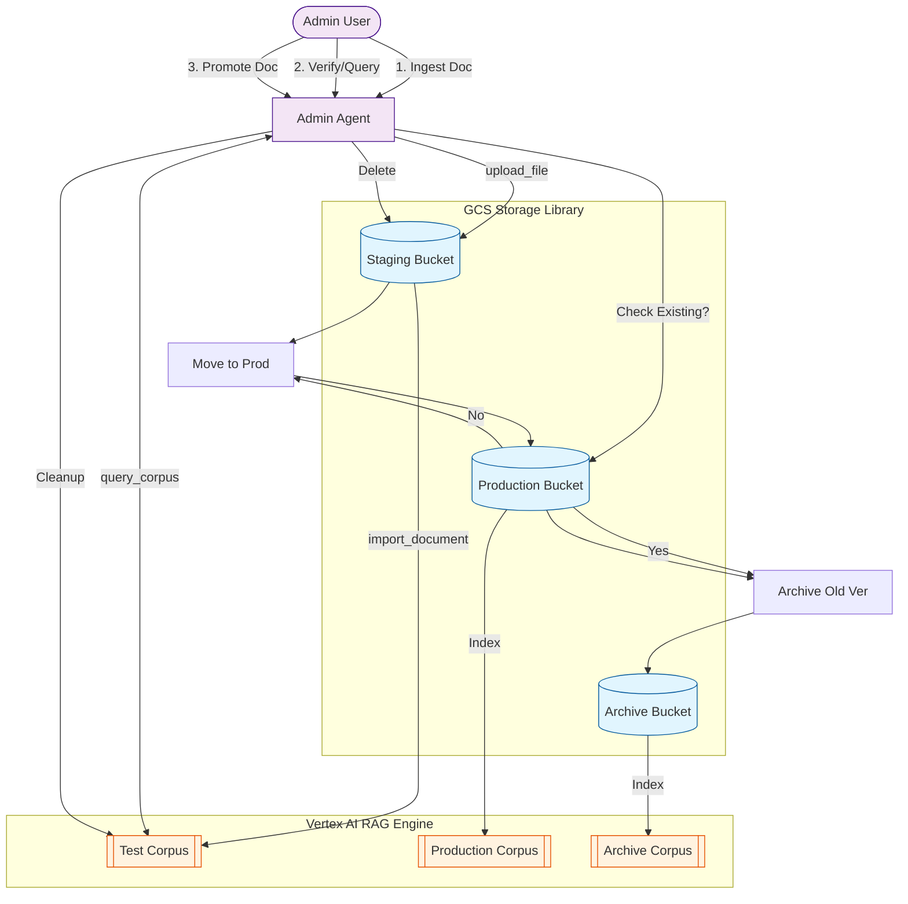

# Admin RAG Agent - Document Lifecycle Management

## Overview
This project builds an Admin RAG Agent using Google's Agent Development Kit (ADK) and Vertex AI. Unlike standard RAG implementations, this project focuses on a strict **document lifecycle management** workflow managed by an intelligent agent.

**Core Philosophy**: Documents are not just "added"; they are promoted through stages.

## The Workflow: Test > Production > Archive

The agent manages documents across three distinct environments (represented by Corpora or specific tagging/metadata strategies):

### 1. Test (Staging) 🧪
*   **Purpose**: Sandbox for validating new documents before they go live.
*   **Naming Convention**: **MUST** include date for tracking (e.g., `test_YYYYMMDD`).
*   **Validation Loop**:
    1.  **Upload Batch**: Admin uploads a batch of files to the Test Bucket.
    2.  **Index**: Agent ingests and indexes these files into a new `test_YYYYMMDD` Corpus.
    3.  **Evaluate**: Admin runs queries to check answer quality.
    4.  **Refine (Loop)**: If quality is poor, Admin requests to swap/update documents. Agent deletes the old file from Test Corpus/Bucket, uploads the new version, and re-indexes. Re-evaluation occurs.
    5.  **Approval**: Only when evaluation passes does the process move to Phase 2.

### 2. Production (Live) 🚀
*   **Purpose**: The single source of truth for the end-user application.
*   **Action**: Once verified in Test, the Admin Agent "promotes" the document.
*   **Constraint**: Only verified documents enter here.

### 3. Archive (History) 🏛️
*   **Purpose**: Audit trail and version history.
*   **Action**: When a document in Production is updated, the *old* version is automatically moved to Archive before the new one takes its place.

---

## Technical Architecture Plan

### 1. Infrastructure (GCP)
*   **Vertex AI RAG Engine**: To host the vector indices (Corpora).
    *   *Corpus A*: `corpus-test`
    *   *Corpus B*: `corpus-prod`
    *   *Corpus C*: `corpus-archive`
*   **Google Cloud Storage (GCS)**: Raw file storage mirroring the lifecycle.
    *   `gs://.../staging/`
    *   `gs://.../prod/`
    *   `gs://.../archive/`

### 2. The Admin Agent Toolset

The agent is equipped with **Lifecycle Tools**, divided into three categories:

#### A. Storage Tools (The Library) 🗄️
*Direct management of raw files in Google Cloud Storage.*

| Tool Name | Function Description |
| :--- | :--- |
| `list_buckets` | Lists all available buckets (Staging, Prod, Archive). |
| `create_bucket` | Creates a new GCS bucket (if not already existing). |
| `upload_file` | Uploads a local file to the **Staging** bucket (entry point). |
| `list_files` | Lists files within a specific bucket. |
| `move_file` | Moves a file from one bucket to another (e.g., Staging -> Prod). |
| `delete_file` | Deletes a file from a bucket (cleanup). |

#### B. RAG Corpus Tools 🧠
*Management of Vertex AI Vector Search Indices.*

| Tool Name | Function Description |
| :--- | :--- |
| `create_corpus` | Creates a new RAG Corpus (e.g., `test_20260123`). |
| `list_corpora` | Lists all active RAG Corpora. |
| `import_files` | Indexes a file from GCS into a specific Corpus. |
| `query_corpus` | **CRITICAL**: Runs a test query against a specific corpus to validate answers. |
| `delete_corpus` | Deletes a RAG Corpus (e.g., cleaning up a daily test corpus). |
| `get_corpus_id_by_display_name` | Helper to find a corpus ID using its human-readable name. |
| `delete_file_from_corpus` | Removes a specific document from a RAG index. |

#### C. Lifecycle Orchestration Tools (The Admin Logic) ⚡
*High-level "Magic Buttons" that enforce the strict workflow.*

| Tool Name | Function Description |
| :--- | :--- |
| `create_daily_test_corpus` | Automates the start of a test session by creating `test_YYYYMMDD`. |
| `validate_retrieval` | A wrapper for `query_corpus` focused on the Test phase validation. |
| `promote_document_to_prod` | **The Core Workflow**:  1. Checks/Archives old Prod version. 2. Moves new file Staging -> Prod. 3. Indexes into Prod Corpus. 4. Cleans up Staging/Test. |
| `cleanup_test_environment` | Deletes the daily test corpus and resets the staging area. |

---

## Architecture Diagram

---

## Implementation Roadmap

### Phase 1: Foundation
- [ ] Initialize ADK project structure.
- [ ] Set up GCS buckets for `staging`, `prod`, `archive`.
- [ ] Create initial Vertex AI RAG Corpora for `prod` and `archive`.

### Phase 2: Tool Development
- [ ] Develop Python functions for Vertex AI RAG API (Create, List, Import, Delete).
- [ ] Implement the "Swap/Promote" logic (the most critical part).

### Phase 3: Agent Assembly
- [ ] Define the Admin Agent in ADK.
- [ ] Bind tools to the agent.
- [ ] Create a system prompt defining the "Admin" persona and safety checks (e.g., "Always ask for confirmation before archiving").

### Phase 4: Interface
- [ ] CLI or Streamlit UI for the Admin to interact with the agent.

---

## References
*   Base Architecture: [ADK Vertex AI RAG Engine](https://github.com/arjunprabhulal/adk-vertex-ai-rag-engine/tree/main)

---

## File Structure 
adk-vertex-ai-rag-engine/
├── rag/                          # Main project package
│   ├── __init__.py               # Package initialization
│   ├── agent.py                  # The main RAG corpus manager agent
│   ├── config.py                 # Centralized configuration settings
│   └── tools/                    # ADK function tools
│       ├── __init__.py           # Tools package initialization
│       ├── corpus/               # RAG corpus management tools
│       │   └── corpus_tools.py
│       ├── storage/              # GCS bucket management tools
│       │   └── storage_tools.py
│       └── lifecycle/            # High-level workflow orchestration
│           └── lifecycle_tools.py
├── .Images/                      # Demo images and GIFs
└── README.md                     # Project documentation
